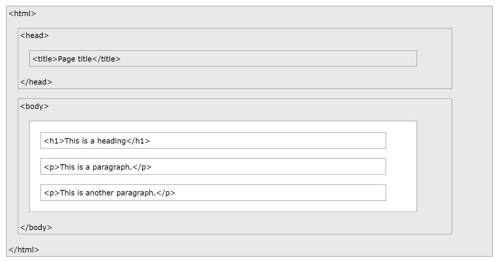
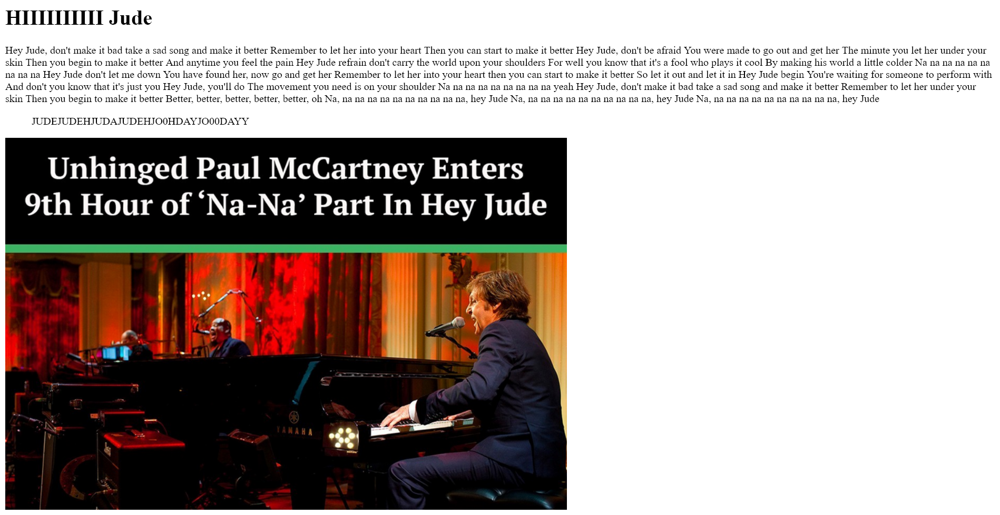
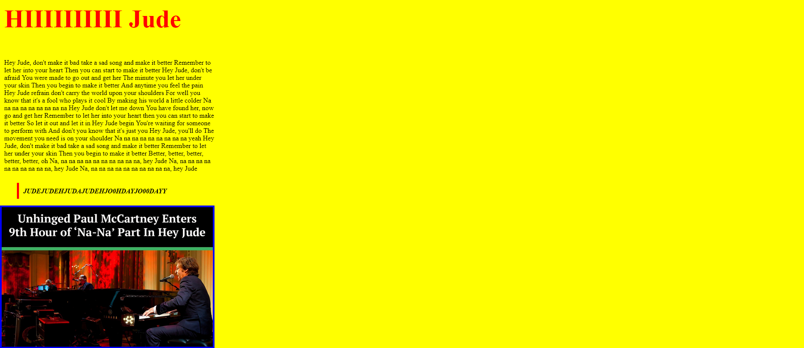
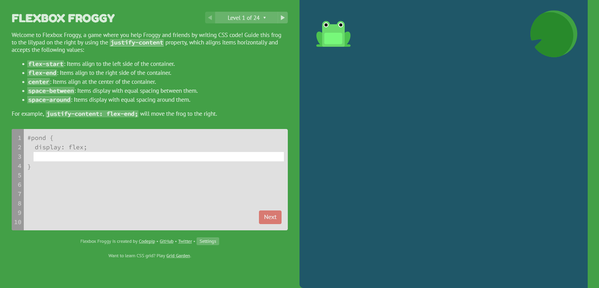

class: left, middle


.pull-left[
### We Will

- Learn **frontend** development and workflows

- Help each other solve problems

- Share resources and create a space to learn

- Rock you
]

.pull-right[
### We Won't
- Learn _everything_ about CSS/HTML/JS. <br/> <br/> That's not realistic.
]
---
class: inverse, center, middle

# Introduction to HTML

---

# Tags Tags Tags Tags

An HTML element is defined by a start tag, some content, and an end tag. 

```{html eval=FALSE, tidy=FALSE}
<html> is for the root document
<head> is for meta information
<p> is for paragraphs
<audio> is for (lol take a guess)
```

.left[]


---

# Today's Special

Since we don't want to care about all the 132 tags today, here's what you want to read up on:

--

- `<div>` Defines a division or section within HTML document.

--

- `<section>` Defines a generic section.

--

- `<h1>, <h2>..., <p>, <span>` Used to render text.


---

# HTML Attributes

Each tag has certain _attributes_, which provide information about that element. Look at the example below.

#### `<h1 id="title" class="page-heading"> Hello World </h1>`

--

The attributes are:

--

- `<h1>` The tag itself.

--

- `id` A unique name for this element. It cannot be repeated.

--

- `class` A name for this class of elements. Multiple elements can share a class name and will be assigned the same properties defined in that class.

---
background-image: url(`r xaringan:::karl`)
background-position: 50% 50%
class: center, bottom, inverse

# Tell me more

---

# CSSssssssss

CSS is all about targeting HTML elements that we write and styling them.  It is pretty simple to understand most of the time. See if you can understand what this does: 
```html
<div id="george">
   <p> My paragraph here. </p>
   <ul>
      <li> List Item 1</li>
      <li> List Item 2</li>
   </ul>

   <ul>
      <li> List Item 3</li>
      <li> List Item 4</li>
   </ul>   
</div>
```
```css
#george {
  background: #e3e3e3;
  border-style: dotted;
  border-color: red;
}
```
---
<div id="george">
   <p> My paragraph here. </p>
   <ul>
      <li> List Item 1</li>
      <li> List Item 2</li>
   </ul>

   <ul>
      <li> List Item 3</li>
      <li> List Item 4</li>
   </ul>   
</div>
<style>
#george{
  background: #e3e3e3;
  border-style: dotted;
  border-color: red;
}
</style>

--
<br>
.left[]
---
class: inverse, middle, center
# Game time #1
---
# Pick me pick me


So you have your HTML and you want to write some CSS for it. The first hurdle is learning how to **select** the element you want to style. 

CSS has *many* different ways of allowing you to select objects using **selectors**. It is important to get an understanding of this before we move further. 

Head over to [CSS Feast](https://flukeout.github.io/) and get started.

**There are 32 levels, but you only need to get till level 10-12.**
#### Time: 20 Minutes
---
class: middle, center, inverse
# Lets get codinggggg!
---
# Setting up your IDE

Preflight Checklist:

#### 1. [Install VS Code](https://code.visualstudio.com/download)

#### 2. [Install Git](https://git-scm.com/downloads)

#### 3. [Install Live Server](https://marketplace.visualstudio.com/items?itemName=ritwickdey.LiveServer)
```
https://marketplace.visualstudio.com/items?itemName=ritwickdey.LiveServer
```
This create a local server that will reload every time you save your file, so you can see what you're coding easily. 

#### 4. [Create an account on Github](https://github.com)

#### 5. [Setup Git and Github in VSCode](https://www.jcchouinard.com/install-git-in-vscode/)
---

class: inverse, middle, center

# Take a sad site and make it sadder

---

# Hey Jude

By the end of this short exercise, you will have a crappy website on the internet. Lets go. 

I made this page: 

.left[]


Can we make it look worse?
---

Maybe this?

.left[]

---
class: inverse, middle, center

# But how would I share this file for you to get started?

---

## I'm glad you asked. Let's Git to it. 

Git is a version control system.  What this means is that it basically lets multiple people access a central source of what is usually code, and make alterations to it without messing it up for other people.

--

In development, its used to collaborate between teams. This works in the following way: 

1. There is a central code 'repository'. 

--

2. Each member can then copy this **master copy** and create their own **fork**.

--

3. If me and you are working on the same fork, it is better to create two copies of what we're working on and develop on things separately. Each copy here is called a **branch**.

--

4. Because we're able to save versions of our progress, if you screw up your branch, I can just tell Git 'Hey could you go back to the time before this monkey touched the code?' and continue working from there.

---
class: middle, center
# We'll be learning Git thoroughly in a later session. <br> <br> For now, we'll just use some simple commands
---


1. First, copy this link below:
```
https://github.com/thedivtagguy/activity1
```
--

2. Now open VSCode and press <kbd>Ctrl</kbd> + <kbd>Shift</kbd> + <kbd>P</kbd> and search for `Clone`. 
--

3. Paste in the URL and press <kbd>Enter</kbd>. You will be prompted to select a location. 
--

4. Open the cloned files. 

You just used Git to fetch from a remote source to your local machine! 

--
##### _This slide is dedicated to Dolly the sheep, who was also a clone_
---
In the next part, we will launch this crap into space. First add some ✨ styles to the files.✨
### Time: 10 Minutes


#### Tips to make your life easier

1. Enable a [split editor](https://code.visualstudio.com/docs/getstarted/userinterface#_side-by-side-editing) so you can edit two files side by side. 

2. Fire up your live server.


---

## Here are some sample properties to try

.pull-left[

 - `padding: 10px;`

 - `font-size: 15px;`
 
 - `font-weight: bold;`
 
 - `background-color: #c7980b;`
 
 - `border: solid`
]

.pull-right[

 - `border-width: 3px;`
 
 - `color: #423e34;`
 
 - `margin-top: 40px;`
 
 - `font-family: sans-serif`

]

---
class: middle, center, inverse
# Cool cool cool stop now
---

# Houston, we're ready for takeoff.

Open up a new terminal in VS Code. Type in the following code: 

```js
git init // This initializes a new git repository on your machine

git add -A // Every time you want to save a new version, you have to add all files to this version

git commit -m "My First Commit" // The commit command saves the version with a message to help you keep track of things
```
--
Now go to Github and create a new repo. After you give it a name, copy the line that looks like this and paste it in your terminal: 

```js
git remote set-url origin github.com/thedivtagguy/activity1.git // This is connecting your local copy to this Github repository
```
--
Finally, write this and press Enter: 
```js
git push -u -f origin master
```
---

# Netlify and Chill

To host our website, we'll use a service called Netlify. It is a static site hosting service, which means as long as our website doesn't have a database, we can host it for free.

1. Go to [Netlify.com](https://netlify.com) and login with your Github account

2. Add a new site. In the options, choose 'Import Existing Project'

3. Select Github and search for the repository you just created

4. Click deploy

In a few minutes, your website will be online with a silly looking URL. 
--
<br><br>
But see, here's the cool part. Go back to VS Code and make some changes to the text. After you're done, create a new commit like so:
```js
git add -A
git commit -m "Change of text"
git push
```
---
class: inverse, middle, center

# Wait for it, wait for it
---
class: inverse, middle, center

# Cool, now go back to your URL
---
# Git-based deployment

Since your Netlify site is connected to your Github repository, every time you push a new commit to your repository, Netlify will rebuild your website and put the new version up online. 

This is very useful and as we go deeper into using modern web-development frameworks, you'll see why this is one of the best ways of working on a project.

.left[]
---
background-image: url(`r xaringan:::karl`)
background-position: 50% 50%
class: center, bottom, inverse

# But can we make this look prettier?
---

# Weird flex but okay

Most of the websites we made right now, a few moments ago, are just elements stacked on top of each other. What if we learn how to arrange stuff on the page so that it looks better? 

Maybe like this: 

.left[]


This is where *flexbox* comes in.
---
class: inverse, middle, center

# Game time #2
---

To understand how flexbox works, we'll play a game called Flexbox Froggy. It sounds lame but hear me out:

Its got frogs. Lets play.




```
flexboxfroggy.com
```
#### Time: 20-25 Minutes
---
class: inverse, middle, center

# Yeah you're so done now, I can see it. 
---
# Quick Recap

You're now armed with the knowledge of:

1. Tags
2. CSS Selectors
3. CSS Flexbox
3. Developing in VS Code
4. Pushing and pulling from remote and loval repositories with Git
5. Deploying to Netlify
---
# Activity 2

You'll never be asked to design the abomination you made in the earlier activity. However, being asked to code a UI screen is extremely likely. If you're interested in developing the earlier skills further, here's a challenge.

## I've designed a product page in Figma and coded the bare, unstyled HTML for it. Can you apply CSS so that the HTML looks like the design file?

#### Files are at
```
https://github.com/thedivtagguy/activity2
```

---
background-image: url(images/design.png)
background-size: 1000px
background-position: 50% 50%

---
# To summarize the summary

1. Clone the repo on your machine
2. Look at the design and try to use your knowledge of CSS selectors and flexbox to recreate it

**Note:** You will still have to Google what other CSS properties you need to use. Ask questions like 'How do I make the buttons rounded?' or 'How do I change the font?' and Google them. Lather, rinse, repeat. 

3. Push your files to Github
4. Deploy this new repository to Netlify.
---
background-image: url(images/all.jpg)
background-size: 1000px
background-position: 50% 50%

